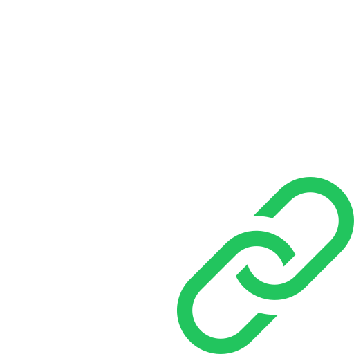

<h1 style="margin: 0;">fLink</h1>
The only self-hosted URL shortener that allows you to keep the path after the alias.
(and the best self-hosted option)

## Features

- Vercel-ready shipping
- Custom domains support
- Easy 5min setup
- MongoDB for persistent storage and Upstash for caching
- Clerk for authentication

## TO-DO

- [ ] Add QrCode generation
- [ ] Add support for custom domains validation for non-vercel environments
- [ ] Improve the design

## Credits

- Inspired by [ishortn.ink](https://github.com/AmoabaKelvin/ishortn.ink)
